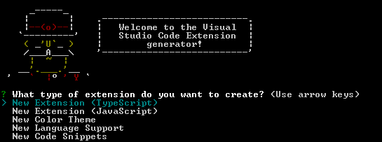

# Visual Stidio Code 扩展

>不是原语翻译 

这里根据vscode官方文档构建第一个VS code扩展。 如果你对VS code的可扩展性设计方感兴趣，你可以在[这里](https://code.visualstudio.com/docs/extensions/our-approach)阅读它。

>在开发扩展之前,其实可以有好几种方法个性化vs code,包括[主题,语言支持,代码片段](./vscode个性化设置.md)而且不用写一句代码

## **vs code 状态**
---
<table style="background-color:#005588; color:yellow">
<thead>
<tr>
<th>Context name</th>
<th>True when</th>
</tr>
</thead>
<tbody>
<tr>
<td><strong>Editor contexts</strong></td>
<td></td>
</tr>
<tr>
<td>editorFocus</td>
<td>An editor has focus, either the text or a widget.</td>
</tr>
<tr>
<td>editorTextFocus</td>
<td>The text in an editor has focus (cursor is blinking).</td>
</tr>
<tr>
<td>editorHasSelection</td>
<td>Text is selected in the editor.</td>
</tr>
<tr>
<td>editorHasMultipleSelections</td>
<td>Multiple regions of text are selected (multiple cursors).</td>
</tr>
<tr>
<td>editorReadOnly</td>
<td>The editor is read only.</td>
</tr>
<tr>
<td>editorLangId</td>
<td>True when the editor's associated language Id matches. Example: <code>"editorLangId == typescript"</code>.</td>
</tr>
<tr>
<td><strong>Mode contexts</strong></td>
<td></td>
</tr>
<tr>
<td>inDebugMode</td>
<td>A debug session is running.</td>
</tr>
<tr>
<td>inSnippetMode</td>
<td>The editor is in snippet mode.</td>
</tr>
<tr>
<td>inQuickOpen</td>
<td>The Quick Open dropdown has focus.</td>
</tr>
<tr>
<td><strong>Editor widget contexts</strong></td>
<td></td>
</tr>
<tr>
<td>findWidgetVisible</td>
<td>Editor Find widget is visible.</td>
</tr>
<tr>
<td>suggestWidgetVisible</td>
<td>Suggestion widget (IntelliSense) is visible.</td>
</tr>
<tr>
<td>suggestWidgetMultipleSuggestions</td>
<td>Multiple suggestions are displayed.</td>
</tr>
<tr>
<td>renameInputVisible</td>
<td>Rename input text box is visible.</td>
</tr>
<tr>
<td>referenceSearchVisible</td>
<td>Find All References peek window is open.</td>
</tr>
<tr>
<td>inReferenceSearchEditor</td>
<td>The Find All References peek window editor has focus.</td>
</tr>
<tr>
<td>config.editor.stablePeek</td>
<td>Keep peek editors open (controlled by <code>editor.stablePeek</code> setting).</td>
</tr>
<tr>
<td>quickFixWidgetVisible</td>
<td>Quick Fix widget is visible.</td>
</tr>
<tr>
<td>parameterHintsVisible</td>
<td>Parameter hints are visible (controlled by <code>editor.parameterHints</code> setting).</td>
</tr>
<tr>
<td>parameterHintsMultipleSignatures</td>
<td>Multiple parameter hints are displayed.</td>
</tr>
<tr>
<td><strong>Integrated terminal contexts</strong></td>
<td></td>
</tr>
<tr>
<td>terminalFocus</td>
<td>An integrated terminal has focus.</td>
</tr>
<tr>
<td><strong>Global UI contexts</strong></td>
<td></td>
</tr>
<tr>
<td>resourceLangId</td>
<td>True when the Explorer or editor title language Id matches. Example: <code>"resourceLangId == markdown"</code></td>
</tr>
<tr>
<td>globalMessageVisible</td>
<td>Message box is visible at the top of VS Code.</td>
</tr>
<tr>
<td>searchViewletVisible</td>
<td>Search view is open.</td>
</tr>
<tr>
<td>replaceActive</td>
<td>Search view Replace text box is open.</td>
</tr>
</tbody>
</table>

 **本次关注的API**
---
```
{
"contributes": {
    "commands": [{
        "command": "extension.sayHello",
        "title": "Hello World"
    }]
}
```
对应
```
commands.registerCommand('extension.sayHello', () => {
        window.showInformationMessage('Hello World!');
});
```


# 扩展

所有被激活的扩展都在一个共享的宿主进程中运行. 这样可以保证编辑器可以保持持续的响应.

## package.json 描述了扩展的基本信息

>vscode 预览不能直接支持表格
<table><thead><tr>
<th>Name</th><th style="text-align:center">Required</th><th>Type</th><th>Details</th></tr></thead><tbody><tr>
<td><code>name</code></td><td style="text-align:center">Y</td><td><code>string</code></td><td>The name of the extension - should be all lowercase with no spaces.</td></tr>
<tr>
<td><code>version</code></td>
<td style="text-align:center">Y</td><td><code>string</code></td><td><a href="http://semver.org/"  target="_blank">SemVer</a> compatible version.</td></tr>
<tr><td><code>publisher</code></td><td style="text-align:center">Y</td>
<td><code>string</code></td>
<td>The <a href="/docs/tools/vscecli#_publishers-and-personal-access-tokens">publisher name</a></td>
</tr>
<tr>
<td><code>engines</code></td>
<td style="text-align:center">Y</td>
<td><code>object</code></td>
<td>An object containing at least the <code>vscode</code> key matching the versions of VS Code that the extension is compatible with.  Cannot be <code>*</code>. For example: <code>^0.10.5</code> indicates compatibility with a minimum VS Code version of <code>0.10.5</code>.</td>
</tr>
<tr>
<td><code>license</code></td>
<td style="text-align:center"></td>
<td><code>string</code></td>
<td>Refer to <a href="https://docs.npmjs.com/files/package.json#license"  target="_blank">npm's documentation</a>. If you do have a <code>LICENSE</code> file in the root of your extension, the value for <code>license</code> should be <code>"SEE LICENSE IN &lt;filename&gt;"</code>.</td>
</tr>
<tr>
<td><code>displayName</code></td>
<td style="text-align:center"></td>
<td><code>string</code></td>
<td>The display name for the extension used in the Marketplace.</td>
</tr>
<tr>
<td><code>description</code></td>
<td style="text-align:center"></td>
<td><code>string</code></td>
<td>A short description of what your extension is and does.</td>
</tr>
<tr>
<td><code>categories</code></td>
<td style="text-align:center"></td>
<td><code>string[]</code></td>
<td>the categories you want to use for the extensions allowed values: <code>[Languages, Snippets, Linters, Themes, Debuggers, Formatters, Keymaps, Other]</code></td>
</tr>
<tr>
<td><code>keywords</code></td>
<td style="text-align:center"></td>
<td><code>array</code></td>
<td>An array of <strong>keywords</strong> or <strong>tags</strong> to make it easier to find the extension.</td>
</tr>
<tr>
<td><code>galleryBanner</code></td>
<td style="text-align:center"></td>
<td><code>object</code></td>
<td>Helps format the Marketplace header to match your icon.  See details below.</td>
</tr>
<tr>
<td><code>preview</code></td>
<td style="text-align:center"></td>
<td><code>boolean</code></td>
<td>Sets the extension to be flagged as a Preview in the Marketplace.</td>
</tr>
<tr>
<td><code>main</code></td>
<td style="text-align:center"></td>
<td><code>string</code></td>
<td>The entry point to your extension.</td>
</tr>
<tr>
<td><a href="/docs/extensionAPI/extension-points"><code>contributes</code></a></td>
<td style="text-align:center"></td>
<td><code>object</code></td>
<td>An object describing the extension's <a href="/docs/extensionAPI/extension-points">contributions</a>.</td>
</tr>
<tr>
<td><a href="/docs/extensionAPI/activation-events"><code>activationEvents</code></a></td>
<td style="text-align:center"></td>
<td><code>array</code></td>
<td>An array of the <a href="/docs/extensionAPI/activation-events">activation events</a> for this extension.</td>
</tr>
<tr>
<td><code>badges</code></td>
<td style="text-align:center"></td>
<td><code>array</code></td>
<td>Array of badges to display in the sidebar of the Marketplace's extension page. Each badge is an object containing 3 properties: <code>url</code> for the badge's image URL, <code>href</code> for the link users will follow when clicking the badge and <code>description</code>.</td>
</tr>
<tr>
<td><code>markdown</code></td>
<td style="text-align:center"></td>
<td><code>string</code></td>
<td>Controls the Markdown rendering engine used in the Marketplace. Either <code>github</code> (default) or <code>standard</code>.</td>
</tr>
<tr>
<td><code>dependencies</code></td>
<td style="text-align:center"></td>
<td><code>object</code></td>
<td>Any runtime Node.js dependencies your extensions needs. Exactly the same as <a href="https://docs.npmjs.com/files/package.json#dependencies" class="external-link" target="_blank">npm's <code>dependencies</code></a>.</td>
</tr>
<tr>
<td><code>devDependencies</code></td>
<td style="text-align:center"></td>
<td><code>object</code></td>
<td>Any development Node.js dependencies your extension needs. Exactly the same as <a href="https://docs.npmjs.com/files/package.json#devdependencies" class="external-link" target="_blank">npm's <code>devDependencies</code></a>.</td>
</tr>
<tr>
<td><code>extensionDependencies</code></td>
<td style="text-align:center"></td>
<td><code>array</code></td>
<td>An array with the ids of extensions that this extension depends on. The id of an extension is always <code>${publisher}.${name}</code>. For example: <code>vscode.csharp</code>.</td>
</tr>
<tr>
<td><code>scripts</code></td>
<td style="text-align:center"></td>
<td><code>object</code></td>
<td>Exactly the same as <a href="https://docs.npmjs.com/misc/scripts" class="external-link" target="_blank">npm's <code>scripts</code></a> but with <a href="/docs/tools/vscecli#_pre-publish-step">extra VS Code specific fields</a>.</td>
</tr>
<tr>
<td><code>icon</code></td>
<td style="text-align:center"></td>
<td><code>string</code></td>
<td>The path to a 128x128 pixel icon.</td>
</tr>
</tbody>
</table>

**完整案例**
```json
{
	"name": "spell",
	"displayName": "Spelling and Grammar Checker",
	"description": "Detect mistakes as you type and suggest fixes - great for Markdown.",
	"icon": "images/spellIcon.svg",
	"version": "0.0.19",
	"publisher": "seanmcbreen",
	"galleryBanner": {
		"color": "#0000FF",
		"theme": "dark"
	},
	"license": "SEE LICENSE IN LICENSE.md",
	"bugs": {
		"url": "https://github.com/Microsoft/vscode-spell-check/issues",
		"email": "smcbreen@microsoft.com"
	},
	"homepage": "https://github.com/Microsoft/vscode-spell-check/blob/master/README.md",
	"repository": {
		"type": "git",
		"url": "https://github.com/Microsoft/vscode-spell-check.git"
	},
	"categories": [
		"Linters", "Languages", "Other"
	],
	"engines": {
		"vscode": "0.10.x"
	},
	"main": "./out/extension",
	"activationEvents": [
		"onLanguage:markdown"
	],
	"contributes": {
		"commands": [
			{
				"command": "Spell.suggestFix",
				"title": "Spell Checker Suggestions"
			}
		],
		"keybindings": [
			{
				"command": "Spell.suggestFix",
				"key": "Alt+."
			}
		]
	},
	"badges": [
		{
			"url": "https://david-dm.org/Microsoft/vscode-spell-check.svg",
			"href": "https://david-dm.org/Microsoft/vscode-spell-check",
			"description": "Dependency Status"
		}
	],
	"scripts": {
		"vscode:prepublish": "node ./node_modules/vscode/bin/compile",
		"compile": "node ./node_modules/vscode/bin/compile -watch -p ./"
	},
	"dependencies": {
		"teacher": "^0.0.1"
	},
	"devDependencies": {
		"vscode": "^0.11.x"
	}
}
```
### contributes
>contributes内的设置可以直接被vscode读取 

contributes.configuration  该选项可以直接被用户使用,当然也可以从用户设置和工作区设置

*contributes.commands*    根据命令标题激活命令 ***当命令激活时,会发出 activationEvent onCommand:${command}***

```
"contributes": {
    "commands": [{
        "command": "extension.sayHello",
        "title": "Hello World"
    }]
}
```
contributes.menus  配置命令触发,比作右键功能的超集吧

contributes.keybindings  快捷键

contributes.languages   不同语言代码的一些自动完成功能

contributes.debuggers

contributes.breakpoints

contributes.grammars   语法

contributes.themes  


扩展支持:

* Activation    加载 
* Editor        内容
* Workspace     控制台,状态条,信息栏等
* Eventing      全生命期事件
* Evoled editing 语言扩展支持如只能提示等等

# 第一个扩展 -- hello world

1. **[安装node.js 并加入环境变量](http://www.runoob.com/nodejs/nodejs-install-setup.html)**
>国内建议下载地址[淘宝镜像下载地址](https://npm.taobao.org/mirrors/node)
>设置npm[淘宝源](https://registry.npm.taobao.org) 
>>npm config set registry https://registry.npm.taobao.org

2. **下载扩展模板生成器** 
> npm install -g yo generator-code

3. **生成模板代码**
>yo code



根据向导操作
 
vscode直接打开生成代码文件夹调试,(或先行发布到市场)
ctrl+p调出command提示窗,输入packkage.json中command对应的title,可发现控制台窗口执行了src代码中的打印语句


